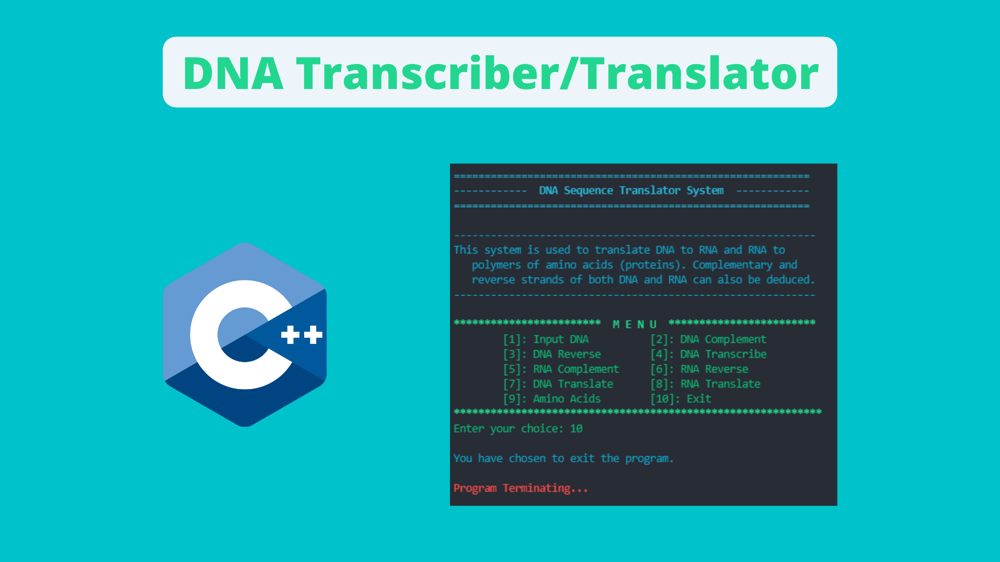

# DNA Transcriber / Translator
DNA Transcription / Translation program for DNA strand manipulation.

Author: Spencer C. DeMera\
Author's email: Spencer.demera@csu.fullerton.edu

--- 
Project is meant as a fun exploration of genetic material manipulation as well as transcription and translation using C++. This system takes a strand of DNA as input and allows for transcribing it to RNA, finding the complement of both the DNA and RNA, reversing the DNA and RNA, as well as translating the DNA and RNA to a protein. System is terminal based and relies on menu navigation via numerical input from the command line.
 
---
Development status.  This programs is done.  It fulfills its purpose of creating a program to fully analyze and manipulate a strand of DNA.

Here "program" means all modules or files in the set; usually there are three of these modules in sample programs used in
this course.

---
File execution: These programs were written in Repl.it Virtual online IDE and compiled using Linux.
